# ASafe Monorepo

Prueba Técnica: Desarrollador Node.js con TypeScript, Fastify, Prisma y Monorepo

## Deployment en Vivo

La aplicación está desplegada y disponible en:

- **API**: http://fastify-api-alb-2001389992.eu-north-1.elb.amazonaws.com/
- **Documentación Swagger**: http://fastify-api-alb-2001389992.eu-north-1.elb.amazonaws.com/docs

### Credenciales de Prueba

Para probar la API puedes usar las siguientes credenciales:

- **Email**: usuario@prueba.com
- **Contraseña**: unodostres

## Arquitectura

Este es un monorepo que contiene múltiples paquetes que trabajan juntos para crear una solución API completa:

```
packages/
├── types/          # Tipos e interfaces TypeScript compartidos
├── utilities/      # Funciones de utilidad compartidas
├── services/       # Servicios de lógica de negocio
└── api/           # Servidor principal de la API Fastify
```

## Diagrama de Arquitectura

```mermaid
graph TB
    %% Client Layer
    Client[👤 Cliente/Frontend]
    WSClient[🔌 WebSocket Client]
    
    %% API Layer
    subgraph "📦 API Package"
        FastifyApp[🚀 Fastify App]
        AuthMiddleware[🔐 Auth Middleware]
        
        subgraph "🛣️ Routes"
            AuthRoutes[👤 Auth Routes]
            UserRoutes[👥 User Routes] 
            PostRoutes[📝 Post Routes]
            UploadRoutes[📤 Upload Routes]
            NotificationRoutes[🔔 Notification Routes]
        end
        
        ErrorHandler[❌ Error Handler]
        Swagger[📚 Swagger Docs]
    end
    
    %% Services Layer
    subgraph "🔧 Services Package"
        Container[📦 TSyringe Container]
        
        subgraph "Services"
            UserService[👤 User Service]
            PostService[📝 Post Service] 
            NotificationService[🔔 Notification Service]
            DatabaseService[🗄️ Database Service]
        end
        
        subgraph "Interfaces"
            IDatabaseService[🔌 IDatabaseService]
            INotificationService[🔌 INotificationService]
        end
    end
    
    %% Utilities Layer
    subgraph "🛠️ Utilities Package"
        FileUploadService[📤 File Upload Service]
        S3Service[☁️ S3 Service]
    end
    
    %% Types Layer
    subgraph "📝 Types Package"
        ZodSchemas[✅ Zod Schemas]
        TypeInterfaces[📋 TypeScript Interfaces]
        UserRole[👑 User Roles]
    end
    
    %% External Services
    subgraph "🌐 External Services"
        PostgresDB[(🐘 PostgreSQL)]
        AWSS3[☁️ AWS S3]
        JWT[🎫 JWT Tokens]
    end
    
    %% Client connections
    Client -->|HTTP REST API| FastifyApp
    WSClient -->|WebSocket| NotificationRoutes
    
    %% API internal flow
    FastifyApp --> AuthMiddleware
    FastifyApp --> ErrorHandler
    FastifyApp --> Swagger
    
    AuthMiddleware --> AuthRoutes
    AuthMiddleware --> UserRoutes
    AuthMiddleware --> PostRoutes
    AuthMiddleware --> UploadRoutes
    AuthMiddleware --> NotificationRoutes
    
    %% Routes to Services via Container
    AuthRoutes -.->|resolve| Container
    UserRoutes -.->|resolve| Container
    PostRoutes -.->|resolve| Container
    UploadRoutes -.->|resolve| Container
    NotificationRoutes -.->|resolve| Container
    
    Container --> UserService
    Container --> PostService
    Container --> NotificationService
    Container --> DatabaseService
    
    %% Service dependencies
    UserService --> IDatabaseService
    UserService --> INotificationService
    UserService --> FileUploadService
    
    PostService --> IDatabaseService
    PostService --> INotificationService
    
    NotificationService -.->|WebSocket connections| WSClient
    
    DatabaseService -.->|implements| IDatabaseService
    NotificationService -.->|implements| INotificationService
    
    %% Utilities usage
    FileUploadService --> S3Service
    UploadRoutes --> FileUploadService
    
    %% Types usage (dotted lines for type dependencies)
    FastifyApp -.->|uses types| ZodSchemas
    AuthMiddleware -.->|uses types| UserRole
    UserService -.->|uses types| TypeInterfaces
    PostService -.->|uses types| TypeInterfaces
    NotificationService -.->|uses types| TypeInterfaces
    
    %% External service connections
    DatabaseService --> PostgresDB
    S3Service --> AWSS3
    AuthMiddleware --> JWT
    
    %% Styling
    classDef clientStyle fill:#e1f5fe
    classDef apiStyle fill:#f3e5f5  
    classDef serviceStyle fill:#e8f5e8
    classDef utilityStyle fill:#fff3e0
    classDef typeStyle fill:#fce4ec
    classDef externalStyle fill:#f1f8e9
    
    class Client,WSClient clientStyle
    class FastifyApp,AuthMiddleware,AuthRoutes,UserRoutes,PostRoutes,UploadRoutes,NotificationRoutes,ErrorHandler,Swagger apiStyle
    class Container,UserService,PostService,NotificationService,DatabaseService,IDatabaseService,INotificationService serviceStyle
    class FileUploadService,S3Service utilityStyle
    class ZodSchemas,TypeInterfaces,UserRole typeStyle
    class PostgresDB,AWSS3,JWT externalStyle
```



## Tecnologías Principales

### Backend Framework
- **Fastify** - Framework web rápido y eficiente para Node.js
- **TypeScript** - Tipado estático para mayor seguridad y productividad
- **Zod** - Validación de esquemas y serialización type-safe

### Base de Datos
- **PostgreSQL** - Base de datos relacional robusta
- **Prisma** - ORM moderno con type-safety y migraciones

### Arquitectura y Patrones
- **TSyringe** - Inyección de dependencias con decoradores
- **Monorepo** - Gestión de múltiples paquetes con Yarn Workspaces
- **Dependency Inversion** - Interfaces para desacoplamiento

### Almacenamiento y Archivos
- **AWS S3** - Almacenamiento de archivos en la nube
- **Multipart Upload** - Manejo de archivos con validación

### Tiempo Real y Comunicación
- **WebSockets** - Notificaciones en tiempo real
- **JWT** - Autenticación stateless segura

### Testing y Calidad
- **Jest** - Framework de testing con mocks
- **Biome** - Linting y formateo rápido
- **Docker** - Containerización para desarrollo y producción

## Dependencias de Paquetes

Los paquetes tienen la siguiente jerarquía de dependencias:

```
api
├── services
│   ├── utilities
│   └── types
├── utilities
│   └── types
└── types

services
├── utilities
└── types

utilities
└── types

types
(sin dependencias internas)
```

## Primeros Pasos

### Requisitos Previos

- Node.js >= 20.0.0
- Yarn (para gestión de workspaces)
- Base de datos PostgreSQL

### Instalación

1. Clonar el repositorio:
```bash
git clone https://github.com/javierlinked/fastify-prisma-monorepo
cd fastify-prisma-monorepo
```

2. Instalar dependencias:
```bash
yarn install
```

3. Configurar variables de entorno:
```bash
cp .env.example .env
# Editar el archivo .env con las credenciales de tu base de datos y AWS
```

4. Generar cliente de Prisma:
```bash
yarn db:generate
```

5. Ejecutar migraciones de base de datos:
```bash
yarn db:migrate
```

## Build

### Build Todos los Paquetes

El proceso de construcción sigue el orden correcto de dependencias:

```bash
yarn build
```

Esto ejecuta:
1. `yarn build:types` - Construye tipos compartidos
2. `yarn build:utilities` - Construye funciones de utilidad  
3. `yarn build:services` - Construye servicios de lógica de negocio
4. `yarn build:api` - Construye el servidor principal de la API


## Pruebas

### Ejecutar Todas las Pruebas

```bash
yarn test
```

### Ejecutar Pruebas para Paquete Específico

```bash
yarn workspace @asafe/api test
yarn workspace @asafe/services test
yarn workspace @asafe/utilities test
```

## Desarrollo

### Iniciar Servidor de Desarrollo

```bash
yarn dev
```

Esto inicia el servidor API con recarga en caliente usando `tsx watch`.

### Calidad de Código

```bash
# Verificar problemas de linting y formato
yarn check

# Corregir todos los problemas
yarn fix
```

### Iniciar Servidor de Producción

```bash
yarn start
```

## Gestión de Base de Datos

### Generar Cliente de Prisma

```bash
yarn db:generate
```

### Ejecutar Migraciones

```bash
yarn db:migrate
```

### Abrir Prisma Studio

```bash
yarn db:studio
```

## Documentación de la API

Una vez que el servidor esté ejecutándose, puedes acceder a:

- **Documentación de la API**: http://localhost:3000/docs
- **Healthcheck**: http://localhost:3000/health

## Detalles de Paquetes

### @asafe/types
Contiene interfaces y tipos TypeScript compartidos:
- Modelos de Usuario y Post
- Tipos de request/response de API
- Re-exportaciones de tipos generados por Prisma

### @asafe/utilities
Funciones de utilidad compartidas:
- Utilidades de carga de archivos con FileUploadService
- Integración con S3 mediante S3Service
- Validación y seguridad de archivos
- Manejo de uploads con configuración flexible

### @asafe/services
Servicios de lógica de negocio con inyección de dependencias:
- UserService: Operaciones de gestión de usuarios y autenticación
- PostService: Operaciones CRUD de posts con notificaciones
- NotificationService: Sistema de notificaciones en tiempo real WebSocket
- DatabaseService: Servicio singleton para acceso a Prisma
- Container: Configuración de TSyringe para DI

### @asafe/api
Servidor principal de la API Fastify con arquitectura moderna:
- Endpoints de API REST con validación Zod
- Soporte WebSocket para notificaciones en tiempo real
- Middleware de autenticación JWT con roles
- Documentación Swagger automática
- Manejo de carga de archivos con AWS S3
- Inyección de dependencias con TSyringe
- Manejo centralizado de errores

## Características de Seguridad

- Autenticación JWT con roles de usuario (USER/ADMIN)
- Hash de contraseñas con bcrypt y salt rounds configurables
- Validación de entrada estricta con esquemas Zod
- Configuración CORS habilitada para desarrollo
- Middleware de autorización basado en roles
- Validación de archivos con tipos MIME y extensiones permitidas
- Sanitización de nombres de archivos subidos
- Variables de entorno centralizadas y seguras

## Endpoints de la API

### Autenticación
- `POST /auth/register` - Registro de usuario
- `POST /auth/login` - Inicio de sesión de usuario
- `GET /auth/me` - Obtener usuario actual
- `POST /auth/refresh` - Actualizar token

### Usuarios
- `GET /users` - Listar usuarios
- `GET /users/:id` - Obtener usuario por ID
- `PUT /users/:id` - Actualizar usuario
- `DELETE /users/:id` - Eliminar usuario

### Posts
- `GET /posts` - Listar posts
- `POST /posts` - Crear post
- `GET /posts/:id` - Obtener post por ID
- `PUT /posts/:id` - Actualizar post
- `DELETE /posts/:id` - Eliminar post

### Carga de Archivos
- `POST /api/upload` - Subir archivo (requiere autenticación)
  - Soporta imágenes: JPEG, PNG, GIF, WebP
  - Validación de tipo MIME y extensión
  - Upload directo a AWS S3
  - Actualización automática de perfil de usuario

### Notificaciones (WebSocket)
- `GET /notifications/ws` - Conexión WebSocket
- `POST /notifications/send/:userId` - Enviar notificación
- `POST /notifications/broadcast` - Difundir notificación


## Notificaciones en Tiempo Real

El proyecto incluye un sistema completo de notificaciones en tiempo real utilizando WebSockets:

### Características Principales

- Conexiones WebSocket autenticadas con JWT
- Gestión automática de conexiones con limpieza periódica
- Eventos automáticos integrados en la lógica de negocio
- Cliente de prueba incluido (`test-ws.html`). De uso local, se conecta a la instancia en AWS (o local).

### Eventos Soportados

- NEW_POST: Se envía cuando un usuario crea un nuevo post (a todos excepto al autor)
- USER_UPDATE: Se envía cuando un usuario actualiza su perfil o foto
- SYSTEM: Mensajes del sistema y confirmaciones de conexión

### Endpoints Administrativos

- `GET /api/notifications/connected` - Lista usuarios conectados
- `GET /api/notifications/status/:userId` - Estado de conexión de usuario
- `POST /api/notifications/send/:userId` - Enviar notificación específica
- `POST /api/notifications/broadcast` - Difundir a todos los usuarios

## Despliegue

### Construcción de Producción

```bash
yarn clean
yarn build
```

### Soporte Docker

Se incluye un Dockerfile para despliegue en contenedores:

```bash
docker build -t fastify-prisma-monorepo .
docker run -p 3000:3000 fastify-prisma-monorepo
```

### TODO

- [x] Inyección de dependencias con TSyringe
- [x] Variables de entorno centralizadas
- [x] Servicios singleton con decoradores
- [x] Interfaces para abstracciones
- [x] Upload de archivos a S3
- [x] WebSocket con autenticación JWT
- [ ] Rate limiting para APIs
- [ ] Mejorar manejo de archivos en users PUT
- [ ] Implementar caché con Redis
- [ ] Logging estructurado con contexto
- [ ] Métricas y monitoreo
- [ ] Tests de integración completos
- [ ] CI/CD pipeline automatizado


## Licencia

Licencia MIT - ver archivo LICENSE
